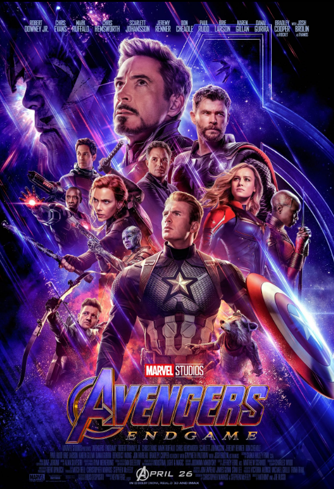

# Avengers: Endgame (2019) 

## Overview 

Directed by Anthony and Joe Russo, *Avengers: Endgame* is a definitive staple of blockbuster event cinema. The story follows the surviving Avengers and their allies after the painful aftermath of Thanos's catastrophic snap. Driven by grief, the heroes assemble once more determined to pull of an ambitious time travel heist to reclaim the Infinity Stones so they can restore the universe wide balance.

## Action and Drama 

The film perfectly merges high stakes time travel with emotional depth. 

### Key Characters 

* **Captain America:** The resilient leader who refuses to move on and stands as the moral compass of the mission. 

* **Iron Man:** The heroic engineer who is balancing the quiet family life. 

* **Ant-Man:** The unexpected key player whose return from the Quantum Realm provides the strategic framework for the time heist.

> "Whatever it takes." – Steve Rogers 

The colossal success of this film set global box office records. Serving as a massive emotional climax, it stands alongside  [[avengers-infinity war]] as a benchmark for modern universe building.