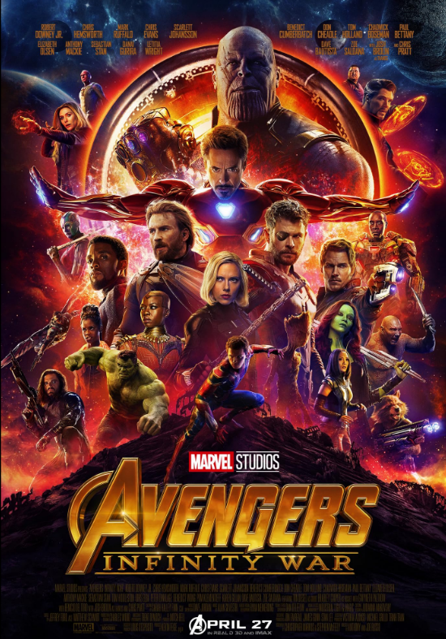

# Avengers: Infinity War (2018) 

## Overview 

Directed by Anthony and Joe Russo, *Avengers: Infinity Wars* is a definitive staple of a very modern superhero cinema. The story follows an extraordinary ensemble of heroes that include the Avengers and Guardians of the Galaxy. They must come together to stop the powerful Thanos and his quest across the cosmos to collect all six Infinity Stones that can erase half of all life in the universe.

## Action and Drama 

The film perfectly merges high energy comic book action with an emotional touch just as much as [[avengers-endgame|Avengers: Endgame]]. Heroes use their superpowers, advanced technology, and willpower to fight back.

### Key Characters 

* **Ironman:** The genius and strategist fighting to keep Earth safe at all costs. 

* **Thor:** The God of Thunder seeking the god-killing weapon to defeat the Mad Titan. 

* **Thanos:** The relentless Titan driven by a radical and misguided mission to balance the cosmos.

> "There was an idea to bring together a group of people, to see if we could become something more." – Tony Stark 

Together with the sequel, [[avengers-endgame|Avengers: Endgame]], the success of *Avengers: Infinity War* proved that the crossover events would dominate the global box office.