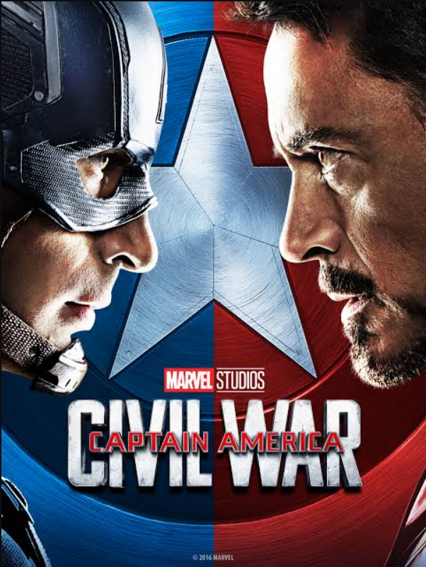

# Captain America: Civil War (2016) 

## Overview 

Directed by Anthony and Joe Russo, *Captain America: Civil War* is a staple of superhero ideological conflicts. This story follows Steve Rogers as he leads the newly formed team of Avengers. Due to political pressure from the government, it fractures the team into opposing factions led by Captain America and Iron Man.
## Action and Drama 

The film perfectly merges hero vs. hero action., deep emotional betrayal, and political tension.
### Key Characters 

* **Captain America:** The leader fighting to keep the Avengers free from government control. 

* **Iron Man:** The hero who supports government oversight to prevent any more collateral damage due to having guilt. 

* **Winter Soldier:** The former assassin who was brainwashed and dark past becomes the fuse that shatters the Avengers.

> "This job, we try to save as many people as we can. Sometimes that doesn't mean everybody, but you don't give up." – Steve Rogers 

The great success of this movie proved that character driven conflict and deep emotional fractures could carry a blockbuster narrative. It stands alongside  [[avengers-infinity war]]  and [[avengers-endgame]].