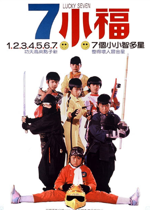

# 7 Lucky Ninja Kids (1986)

## Overview 

Also known as *Lucky Seven*, this Taiwanese action-comedy is a wild ride. The plot kicks off during a summer vacation when a feisty young girl named Little Chilli gathers her childhood friends to welcome their pal Rocky home from the United States. While enjoying a celebration meal at a high end restaurant, Chilli accidentally witnesses a dangerous robbery and murder.  

## The Search for the Diamond 

Before passing away, a victim hands Chilli a massive, valuable diamond. He begs her to return it to its rightful owner. The only clues he provides are that the target lady wears a specific flower and has a distinct mole on her upper thigh. As the kids bumble into hilarious situations trying to find her, an evil eye-patched gangster sends brutal henchmen after them.  

### Martial Arts Specialty Style 

Unlike the more grounded sports dynamics found in [[the-mighty-ducks|The Mighty Ducks]], these seven children are secret martial arts experts who behave like a live action cartoon. Each child brings a unique fighting style to the table: 

1. Complete traditional black ninja gear and stealth tactics. 

2. High-speed Bruce Lee style combat featuring wooden nunchucks. 

3. Competitive western fencing and precision thrusts. 

> "Seven lucky kids all for one!" – Group chant

This film serves as an amazing, chaotic predecessor to later Hollywood hits like [[3-ninjas|3 Ninjas]] and [[the-sandlot|The Sandlot]], showcasing how tight knit childhood friends can conquer any obstacle.