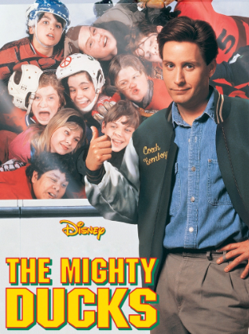

# The Mighty Ducks (1992) 

## Overview 

*The Mighty Ducks* is a classic sports comedy-drama that launched an entire generation of real-world youth hockey enthusiasts. The story stars Emilio Estevez as Gordon Bombay, a hotshot, arrogant lawyer who is sentenced to community service coaching a ragtag, winless youth hockey team in Minnesota.  

## From Underdogs to Champions 

The team begins as a complete disaster, lacking basic skating skills and functional equipment. However, through Bombay's guidance, they learn the value of teamwork and create the famous "Flying V" formation. The team's tight bond and diverse personalities closely mirror the neighborhood friendships seen in [[the-sandlot]]. 

### Essential Team Members 

* **Charlie Conway:** The heart and soul of the squad. 

* **Goldberg:** The hilarious, food-loving goaltender. 

* **Fulton Reed:** The quiet powerhouse with a legendary slapshot. 

> "Ducks fly together!" – The Mighty Ducks

Just as the characters in [[7-lucky-ninja-kids]] use martial arts to conquer adult villains, the Ducks use grit and athletic execution to defeat their corporate, elitist rivals.