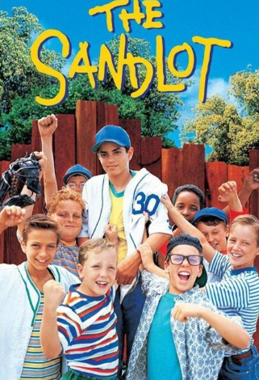

# The Sandlot (1993) 

## Overview 

Set in the nostalgic summer of 1962, *The Sandlot* is a coming-of-age comedy that perfectly captures the magic of childhood. The story is narrated by Scotty Smalls, a nerdy new kid in town who desperately wants to fit in but doesn't even know how to throw a baseball. He is taken under the wing of Benny Rodriguez, the best player in the neighborhood. 

## The Beast Behind the Wall 

The boys spend their endless summer days playing baseball in a run-down local lot. The ultimate conflict arises when Smalls accidentally hits a priceless baseball signed by Babe Ruth over the outfield fence. The yard next door is guarded by a legendary, giant dog known strictly as "The Beast." 

### Creative Rescue Attempts 

To retrieve the irreplaceable baseball, the boys design a series of elaborate contraptions, displaying a level of youthful engineering similar to Kevin's trap-building in [[home-alone]].  

* **Attempt 1:** A modified vacuum cleaner retrieval arm. 

* **Attempt 2:** Erecting a complex system of pulley levers. 

* **Attempt 3:** Deploying a daring vertical canopy drop. 

> "You're killing me Smalls!" – Hamilton Porter

The legendary friendship shared by the team highlights the same unbreakable bond found among the martial artists in [[3-ninjas]]. It remains a definitive masterpiece regarding the joy of being young.