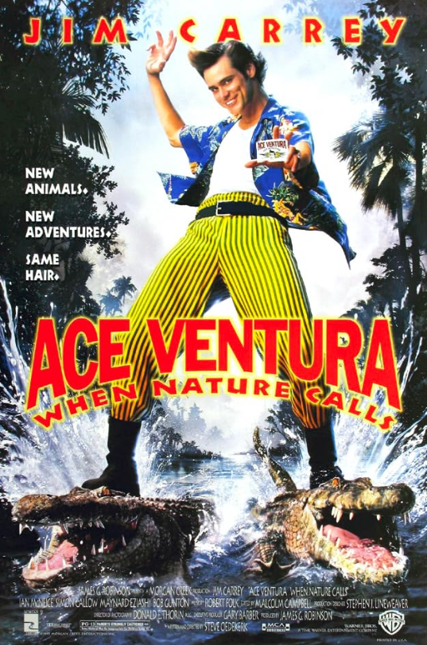

# Ace Ventura: When Nature Calls (1995)

## Overview

Directed by Steve Oedekerk, *Ace Ventura: When Nature Calls* is the hit sequel to the comedy film that launched Jim Carrey into global superstardom. Following a tragic accident in the Himalayas, pet detective Ace Ventura leaves his peaceful retirement in a Tibetan monastery to embark on a dangerous mission in Africa. His goal is to locate a sacred white bat named Shikaka before war breaks out between two local tribes.

## Unhinged Physical Comedy

The film relies heavily on Jim Carrey’s signature physical performance, absurd vocal deliveries, and over the top slapstick humor. Ace navigates treacherous jungle environments, encounters dangerous wildlife, and uses unusual interrogation tactics to crack the case.

### Iconic Moments

* **The Mechanical Rhino:** Ace's frantic attempt to escape a overheating robotic rhino remains one of the most famous comedy scenes of the 1990s.

* **The Projectile Battle:** A hilarious confrontation where Ace accepts a challenge involving spears and darts.

* **Monastery Meditation:** Opening the film with monk training that contrasts sharply with his chaotic energy.
* 

> "Bumblebee tuna! Bumblebee tuna!" – Ace Ventura

The fast-paced, live-action cartoon style of this film mirrors the wild visual effects seen in Jim Carrey's other major 1990s hits, such as [[the-mask]]. Its absurd energy also connects with the chaotic heroics found in youth action films like [[3-ninjas]].