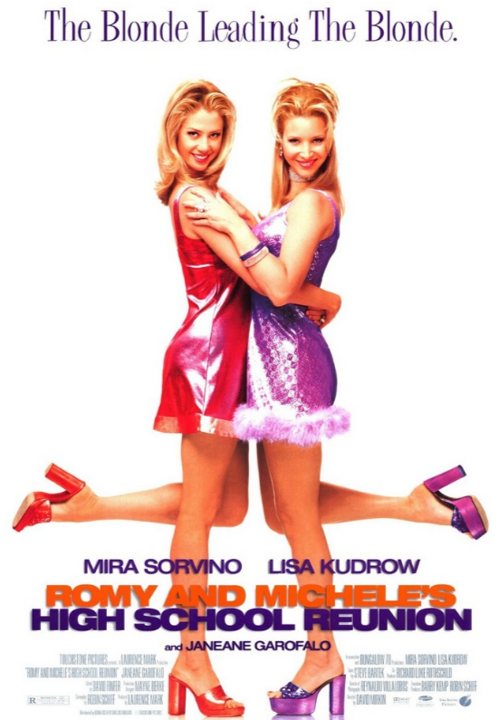

# Romy and Michele's High School Reunion (1997)

## Overview

Directed by David Mirkin, *Romy and Michele's High School Reunion* is a beloved cult comedy starring Mira Sorvino and Lisa Kudrow. The story follows two dim witted yet deeply genuine best friends living in Los Angeles who discover that their 10 year high school reunion is quickly approaching. Realizing their lives aren't as impressive as they had hoped, they decide to invent a elaborate lie: claiming they invented Post it notes.

## Sisterhood and Fashion

The heart of the movie lies in the unbreakable bond between Romy and Michele. Despite social rejection from their former popular classmates, the duo stays true to their eccentric fashion sense and quirky personalities.

### Unforgettable Highlights

1 **The Post it Lie:** The hilarious attempt to explain how they "invented" the adhesive memo pads.

2 **The Interpretive Dance:** A iconic three way dance sequence to Cyndi Lauper’s "Time After Time."

3.**Custom Outfits:** Bright, colorful 90s fashion designs crafted by the characters themselves.

The film's bright color palette and confident sense of humor align with the bold visual style seen in 90s classics like [[the-mask|The Mask]]. At the same time, its focus on tight knit friendships echoes the strong group dynamics found in neighborhood favorites like [[the-sandlot|The Sandlot]] and team sports hits like [[the-mighty-ducks|The Mighty Ducks]].