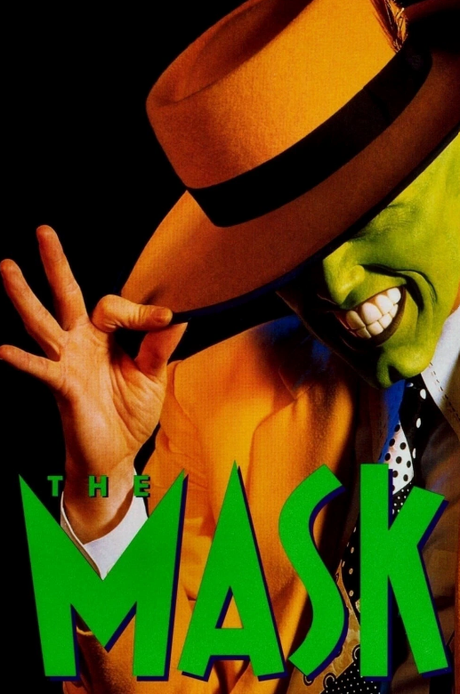

# The Mask (1994)

## Overview

Directed by Chuck Russell, *The Mask* is a fantasy-comedy blockbuster based on the Dark Horse Comics series. The film stars Jim Carrey as Stanley Ipkiss, a timid and unlucky bank teller who discovers an ancient wooden mask created by Loki, the Norse god of mischief. When Stanley puts on the mask, he is instantly transformed into a zany, green-faced superhero with real-life cartoon abilities.

## Visual Effects and Performances

*The Mask* was a landmark film for digital visual effects, seamlessly blending live action slapstick with Looney Tunes style animation. Stanley uses his newfound confidence and supernatural powers to fight criminals, romance nightclub singer Tina Carlyle (played by Cameron Diaz in her breakout role), and outsmart the local police department.

### Key Themes and Elements

* **The Alter Ego:** The transformation allows a mild-mannered man to unleash his wildest inner desires.

* **High Energy Music:** Featuring memorable swing and mambo musical sequences.

* **Dog Sidekick:** Milo, Stanley's clever Jack Russell Terrier, plays a crucial role in rescuing his owner, a dynamic animal partnership similar to the wild creature interactions in [[ace-ventura-when-nature-calls]].

  
The film's blend of high energy, colorful costumes, and larger than life character choices helped define 90s pop culture alongside hit comedies like [[romy-and-micheles-high-school-reunion]].