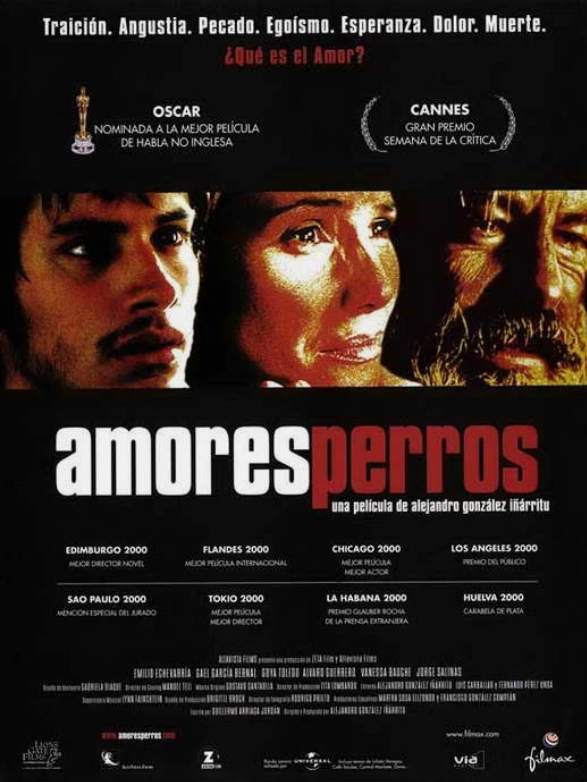

# Amores Perros (2000)

## Overview

Directed by Alejandro González Iñárritu and written by Guillermo Arriaga, *Amores Perros* is a groundbreaking Mexican drama that launched a new wave of Latin American cinema. The narrative utilizes a triptych structure, connecting three distinct stories in Mexico City through a tragic, high-speed car accident.

## Intersecting Lives and Fate

The film explores how a single moment of violence links people from completely different social strata. Dogs serve as a crucial symbolic motif across all three narrative chapters, reflecting the loyalties, brutality, and desperate vulnerabilities of their owners.

### The Three Stories

* **Octavio y Susana:** A young man who enters the underground world of dogfighting to escape with his brother's wife.

* **Daniel y Valeria:** A wealthy magazine editor and a top supermodel whose lives shatter after the car crash.

* **El Chivo y Maru:** An ex guerrilla turned hitman who seeks redemption and a connection with his estranged daughter.

> "If you want to make God laugh, tell Him your plans." – El Chivo

The non-linear storytelling and intense emotional realism found here set a new standard for early 2000s dramas, establishing narrative techniques that would echo in films like [[eternal-sunshine-of-spotless-mind]] and influence character-driven tension like that in [[the-hurt-locker]]. 