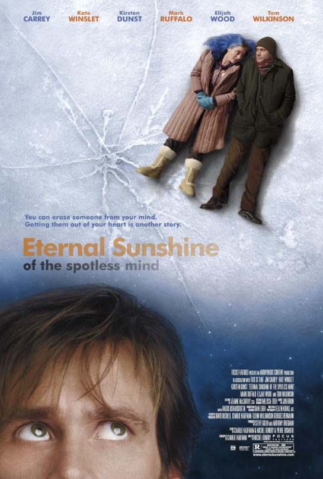

# Eternal Sunshine of the Spotless Mind (2004)

## Overview

Directed by Michel Gondry and written by Charlie Kaufman, *Eternal Sunshine of the Spotless Mind* is a brilliant blend of romantic drama and science fiction. The film follows Joel Barish (Jim Carrey) and Clementine Kruczynski (Kate Winslet), a estranged couple who undergo a medical procedure to erase each other from their memories following a painful breakup.

## Memory, Grief, and Human Connection

As the erasure process occurs inside Joel’s subconscious mind, he relives his memories with Clementine in reverse order. Re experiencing the early, joyous moments of their relationship causes him to regret his decision, leading to a desperate attempt to hide her memory in obscure corners of his brain.

### Key Themes and Elements

* **The Complexity of Heartbreak:** The story argues that pain and grief are essential components of love.

* **Practical Visual Effects:** Gondry uses camera tricks, lighting, and sets rather than heavy digital effects to build a dreamlike environment.

* **Emotional Realism:** Despite the sci-fi premise, the relationship dynamic remains grounded and raw.

  
Much like the harsh realities depicted in [[amores-perros|Amores Perros]], the film refuses to give easy answers about human relationships. 