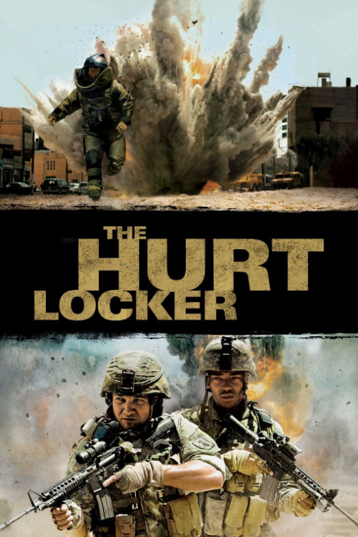

# The Hurt Locker (2008)

## Overview

Directed by Kathryn Bigelow, *The Hurt Locker* is an intense, character-focused war drama that won six Academy Awards, including Best Picture and Best Director. The story follows an Explosive Ordnance Disposal (EOD) unit during the Iraq War, focusing on the psychological strain experienced by soldiers who disarm improvised explosive devices (IEDs) every day.

## The Psychology of Risk

The film centers on Staff Sergeant William James (Jeremy Renner), a reckless yet extraordinarily talented bomb technician. Unlike his team members who count down the days until their deployment ends, James seems to thrive exclusively in high-mortality, hyper-tense situations.

### Core Character Dynamics

1. **William James:** Driven by an adrenaline addiction that isolates him from normal civilian life.

2. **J.T. Sanborn:** A disciplined sergeant who prioritizes protocol and bringing his team home alive.

3. **Owen Eldridge:** A young specialist struggling with fear and the moral weight of combat.

> "The rush of battle is often a potent and lethal addiction, for war is a drug." – Opening Title Quote

  
The film skips traditional political commentary to focus entirely on sensory experience and character study. Its relentless focus on internal pressure mirrors the character struggles in [[eternal-sunshine-of-the-spotless-mind]] and the chaotic urban survival of [[amores-perros]].