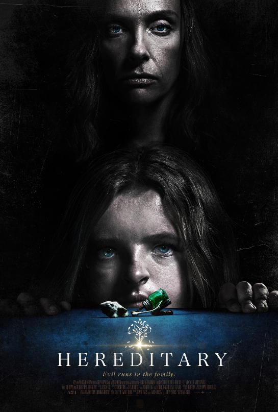

# Hereditary ()

## Overview

Directed by Ari Aster, *Hereditary* is a psychological horror masterpiece that examines how grief, secret histories, and mental illness dismantle a family unit. The story centers on Annie Graham, a miniature artist who struggles to cope with the passing of her secretive, secretive mother, Ellen. 

## Generational Trauma and the Cult

Following a devastating family tragedy involving her daughter Charlie, Annie seeks solace through a spiritual medium named Joan. Unbeknownst to Annie, her family is being manipulated by a sinister cult devoted to Paimon, one of the eight kings of Hell. 

### Key Characters

* **Annie Graham:** A grieving mother whose desire to connect with her deceased children makes her vulnerable.

* **Peter Graham:** The teenage son consumed by guilt, paranoia, and terrifying hallucinations.

* **Steve Graham:** The grounded father who tries in vain to keep the family anchored in reality.

> "I never wanted to be your mother!" – Annie Graham

Unlike traditional hauntings seen in films like [[insidious]], the horror here stems from inescapable fate. The film explores deep psychological breakdown while utilizing eerie audio.