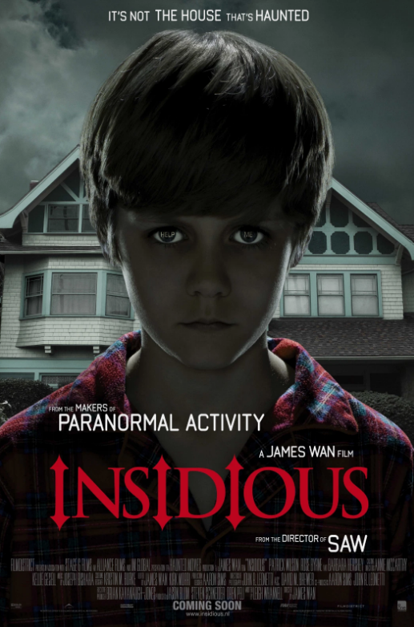

# Insidious (2010)

## Overview

Directed by James Wan and written by Leigh Whannell, *Insidious* breathed new life into the haunted house subgenre by shifting its focus toward spectral realm navigation. The story follows Josh and Renai Lambert, a couple whose young son, Dalton, mysteriously falls into an unexplained coma after moving into a new home.

## The Further and Astral Projection

When supernatural occurrences plague their household, the Lamberts hire a team of paranormal investigators led by Elise Rainier. Elise reveals that Dalton is not in a coma; rather, his spirit has wandered into "The Further," a dark, limbo like dimension inhabited by tormented souls and dangerous demons attempting to inhabit his physical body.

### Threat Levels in The Further

1. **Unbound Ghosts:** Lost spirits seeking secondary physical presence.

2. **The Long Haired Fiend:** A aggressive entity stalking the household hallways.

3. **The Lipstick Face Demon:** The primary antagonist seeking total possession of Dalton's body.

  

The film relies heavily on sudden jump scares and visual dread, contrasting sharply with the slow burn horror of [[hereditary]]. 